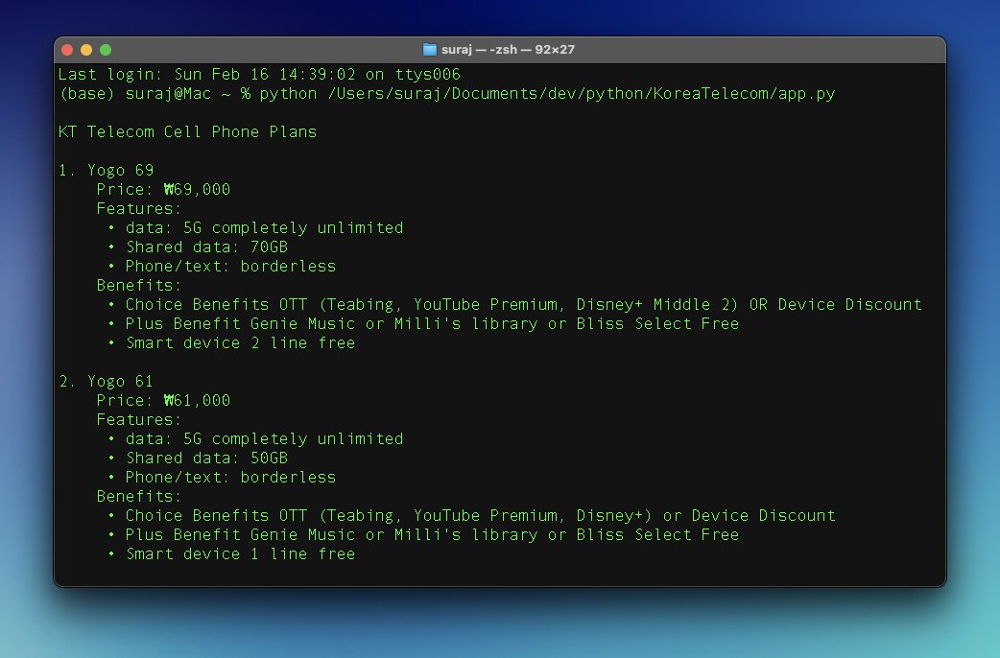
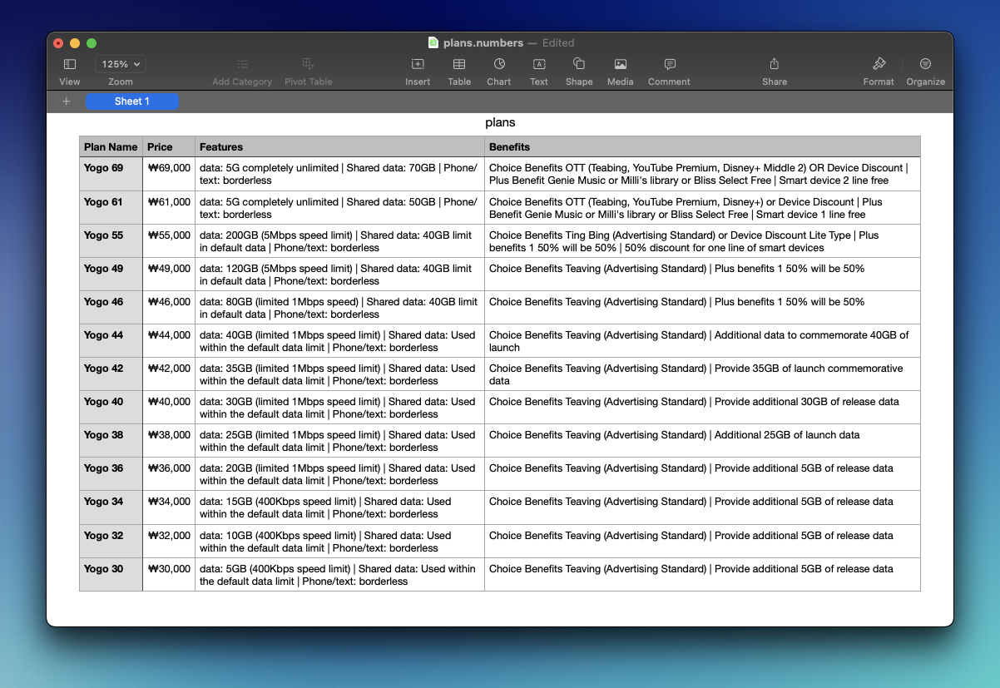

# KoreaTelecom
 Mobile plan details of Korea Telecom (KT).

The program fetches the plan details (Plan Name, Price, Features, Benefits) of each of the offered plans. Then, it displays the data in terminal, and also creates a csv file with all the data organized.

**Note**: _The source language is in Korean, so the program also converts Korean text to English, before adding to the all_plans dict._

